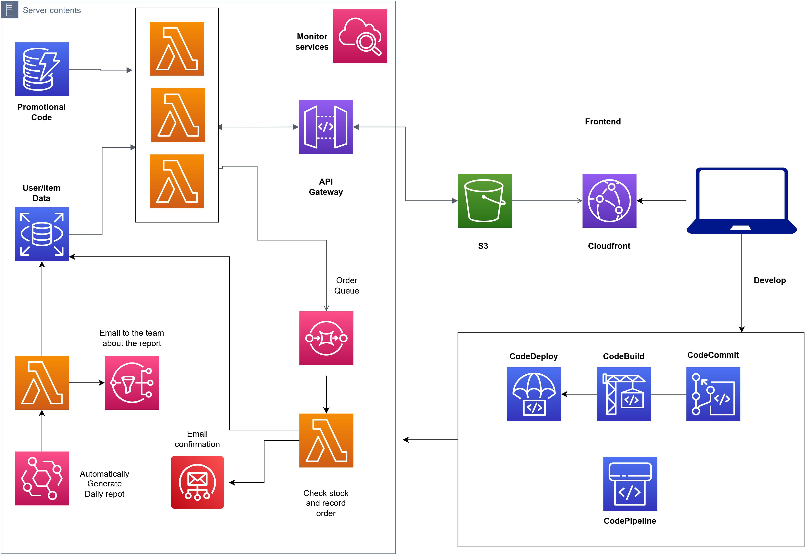

# Serverless Project

## Table of Contents

<ol>
  <li><a href="#about">About</a></li>
  <li><a href="#project-status">Project Status</a></li>
  <li><a href="#built-with">Built With</a></li>
  <li><a href="#architecture">Architecture</a></li>
</ol>

## About
A fully serverless project using AWS microservices! The website is hosted using a S3 bucket, with CloudFront for faster delivery, as it is a static website. 
The users' requests are managed through AWS's API Gateway and lambda calls. 
User data along with the inventory is stored using RDS (MySQL) and DynamoDB. 
Once an order is placed, SES (Simple Email Service) is triggered to alert the admin (owner) of product purchase. 
A log of daily sales is also generated using SNS (Simple Notification Service).

<i>The frontend is created using basic react templates as this wasn't the focus of the project. </i>

## Project Status

This project is currently offline as the account used to set up the project is no longer available. Also, as most AWS services charge the user, the project cannot be indefinitely online.

## Built With

- 
- 
- 

## Architecture

The client sends a request to access the website to CloudFront to display the website. From there lambda calls are made through the API Gateway depending on user/ admin requests. Incase there are too many requests made in a very short amount, SQS (Simple Queue Service) manages by acting as a buffer between the producer and the consumer, making sure all messages are delivered. Sending a receipt to the user/ admin once an item is purchased and generating a daily sales report for the admin is all triggered and managed by lambda functions.

Refer/ download architecture pdf <a href="https://github.com/ogharambae/serverless_shoe_store/blob/master/architecture.jpg">here</a>.